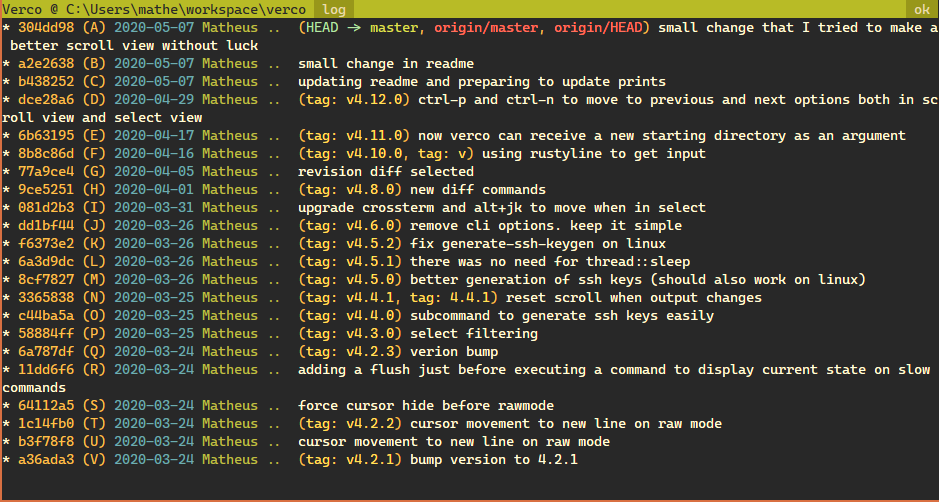

# verco
A simple Git/Hg tui client focused on keyboard shortcuts

## Screenshots



## Platforms

This project uses Cargo and pure Rust stable so it should work on Windows, Mac and Linux.

It depends on:
- [crossterm](https://crates.io/crates/crossterm)
- [ctrlc](https://crates.io/crates/ctrlc)
- [rustyline](https://crates.io/crates/rustyline)

## Install

You can either install it via `cargo` or download the binaries from github releases.

If you go the `cargo` route, you can install it using [rustup](https://www.rustup.rs/).
In a terminal, run this command to install `verco`:

```
cargo install verco
```

You'll be able to open `verco` from whichever directory you in.

## Usage

In a terminal in a repository folder, run the `verco` command.
It will launch `verco`'s tui and you'll be able to interface with git/hg.

## Commands

Key Sequence | Command
--- | ---
h | help
q | quit
s | status
ll | log
lc | log count
dd | current diff all
ds | current diff selected
DC | revision changes
DD | revision diff all
DS | revision diff selected
cc | commit all
cs | commit selected
m | merge
RA | revert all
rs | revert selected
rr | list unresolved conflicts
ro | resolve taking other
rl | resolve taking local
f | fetch
p | pull
P | push
tn | new tag
bb | list branches
bn | new branch
bd | delete branch
x | custom command

## Custom Commands
You can create simple custom commands to run in your repository folder by placing them in the file
`.verco/custom_commands.txt` in your repository root.

Each line in this file is treated as a different custom command. Until the first whitespace, the characters are
treated as the keybind for the command, the next word is the command itself, and the rest are its parameters.

Example:
```
gv git --version
```

With `verco` open, you can type in `xgv` (`x` is the custom command prefix) and it will print your git version
without leaving `verco`. Use it to create build commands for example.
